# Modern HTML & CSS Practice Projects

This repository contains a collection of frontend projects I built while learning **Modern HTML & CSS From The Beginning 2.0** — a comprehensive course that teaches web development from the basics to advanced responsive design and layout techniques.

---

## 📘 Course Overview

**Modern HTML & CSS From The Beginning 2.0** is a step-by-step web development course focused on building responsive, modern websites using HTML5 and CSS3. It starts with foundational concepts and progresses to real-world projects so students can apply what they learn in practical scenarios. 

- HTML5 fundamentals, semantic markup, and structuring web pages.
- CSS basics, selectors, typography, colors, and layout principles.
- Responsive design with Flexbox and CSS Grid for flexible layouts.
- Advanced CSS features like transitions, animations, and pseudo-classes. 
- Practical development workflow using VS Code, Live Server, and deployment. 
- Building real UI projects like agency websites, forms, and product landing pages.

This course is beginner-friendly and also valuable for anyone wanting to solidify their frontend skills.

---

##  Projects & Challenges

| Project Name | Description | Live Demo | Source Code |
|-------------|-------------|-----------|-------------|
| Tutor | A modern landing page practice project with responsive design principles | [Live](https://websitetutorcss.netlify.app/) | [Visit](https://github.com/naharluna/Modern-HTML-CSS-From-The-Beginning-2.0/tree/75e9478e101c092743c278c60283a88ac92c0c49/Section%2018%20Tutor%20Website%20Project) |
| Leno | Product landing page featuring Flexbox layout and call-to-action sections | [Live](https://lenoappproject.netlify.app/) | [Visit](https://github.com/naharluna/Modern-HTML-CSS-From-The-Beginning-2.0/tree/75e9478e101c092743c278c60283a88ac92c0c49/Section%2020%20Leno%20Website%20Project%20(BEM)) |
| Landing Form (Bono App) | A modern Coming Soon landing page built with HTML and CSS, featuring a gradient background and a simple contact form. | [Live](https://bonominilandingform.netlify.app/) | [Visit](https://github.com/naharluna/Modern-HTML-CSS-From-The-Beginning-2.0/tree/75e9478e101c092743c278c60283a88ac92c0c49/Section%209%20Landing%20Form%20Mini%20Project) |
| Lumina Website | A multi-section website with navigation, gallery, and footer | [Live](https://luminacreativen.netlify.app/) | [Visit](https://github.com/naharluna/Modern-HTML-CSS-From-The-Beginning-2.0/tree/75e9478e101c092743c278c60283a88ac92c0c49/Section%2011%20Lumina%20Creative%20Website%20Project) |
| Presentation Slide | A simple presentation slide layout using HTML & CSS | [Live](https://presentationslideminiproject.netlify.app/) | [Visit](https://github.com/naharluna/Modern-HTML-CSS-From-The-Beginning-2.0/tree/75e9478e101c092743c278c60283a88ac92c0c49/Section%2016%20Transitions%2C%20Animation%20%26%20A%20Little%20JavaScript/Presentation%20Website%20Mini-Project) |
| CSS Grid Challenge One | Basic CSS Grid layout practice project | [Live](https://gridchallangeone.netlify.app/) | [Visit](https://github.com/naharluna/Modern-HTML-CSS-From-The-Beginning-2.0/tree/75e9478e101c092743c278c60283a88ac92c0c49/Section%2015%20CSS%20Grid/Grid%20Challange%201) |
| CSS Grid Challenge Two | Advanced CSS Grid layout practice project | [Live](https://gridchallangetwo.netlify.app/) | [Visit](https://github.com/naharluna/Modern-HTML-CSS-From-The-Beginning-2.0/tree/75e9478e101c092743c278c60283a88ac92c0c49/Section%2015%20CSS%20Grid/Grid%20Challange%202) |
| Selector Challenge | CSS selectors and styling practice project | [Live](https://selectorchallange.netlify.app/) | [Visit](https://github.com/naharluna/Modern-HTML-CSS-From-The-Beginning-2.0/tree/75e9478e101c092743c278c60283a88ac92c0c49/Section%2014%20Advanced%20Selectors%20-%20Pseudo%20Classes%20%26%20Elements/Selector%20Challange) |
| Pricing Card Challenge | A responsive pricing section built with HTML and CSS Grid. | [Live](https://pricinggridchallange.netlify.app/) | [Visit](#) |
| Flexbox Layout Challenge | Responsive layout practice using Flexbox | [Live](https://flexlayoutchallange.netlify.app/) | [Visit](https://github.com/naharluna/Modern-HTML-CSS-From-The-Beginning-2.0/tree/75e9478e101c092743c278c60283a88ac92c0c49/Section%208%20Responsive%20Device/Challange) |
| Shoe Card | Product card UI mini project | [Live](https://shoecardmini.netlify.app/) | [Visit](https://github.com/naharluna/Modern-HTML-CSS-From-The-Beginning-2.0/tree/75e9478e101c092743c278c60283a88ac92c0c49/Section%206%3A%20Box%20Model%20%26%20Positioning/11.%20%20Shoe%20Cards%20Mini-Projects) |
| Freelance Form | Clean and responsive freelance signup form | [Live](https://freelanceform.netlify.app/) | [Visit](https://github.com/naharluna/Modern-HTML-CSS-From-The-Beginning-2.0/tree/75e9478e101c092743c278c60283a88ac92c0c49/Section%206%3A%20Box%20Model%20%26%20Positioning/10.%20Freelance%20Form%20Project) |

---

## 📸 Project Screenshots

Below are preview screenshots of some selected projects.  
(Screenshots will be updated as the projects evolve.)

### Lumina Creative – Website Pages

| Home | About | Contact |
|------|-------|---------|
| 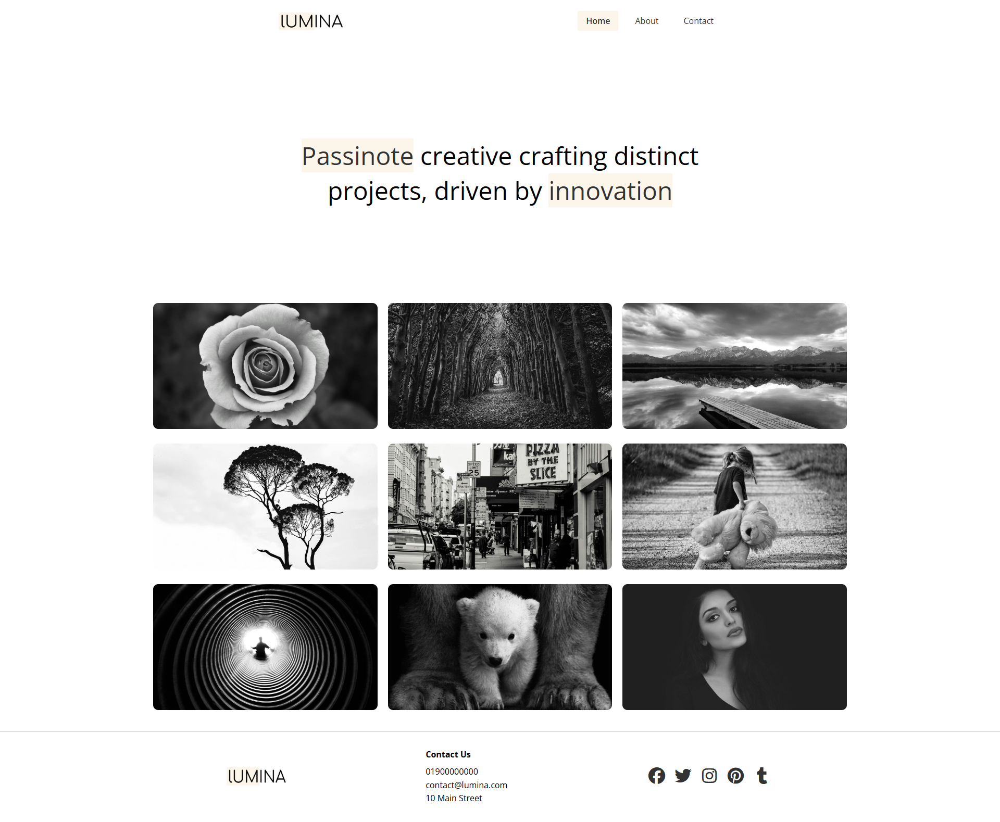 | 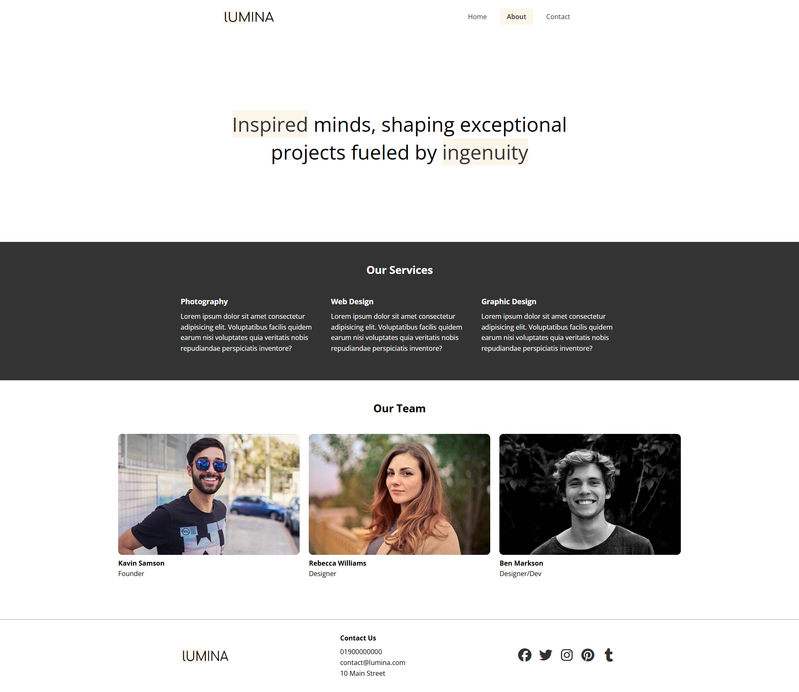 | 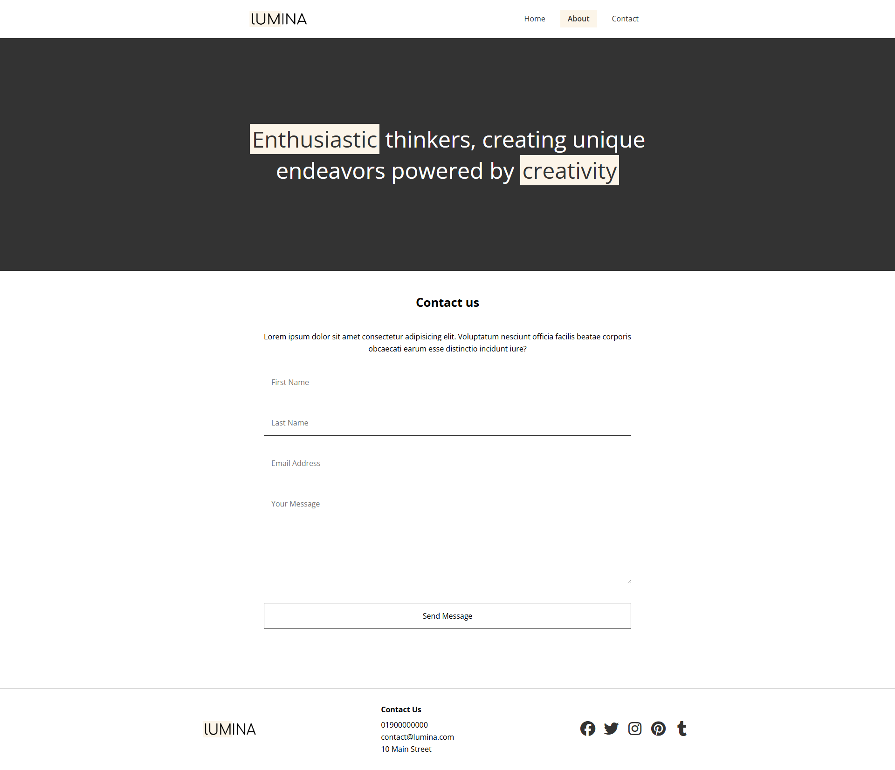 |

### Bono Mini Landing Form

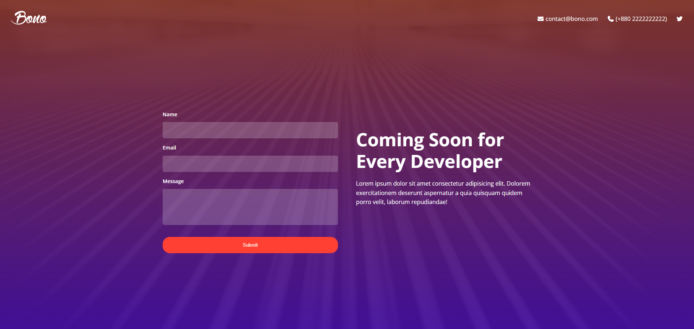

### Tutor Website

### Tutor Website – Main Pages

| Home | About | Contact |
|------|-------|---------|
| 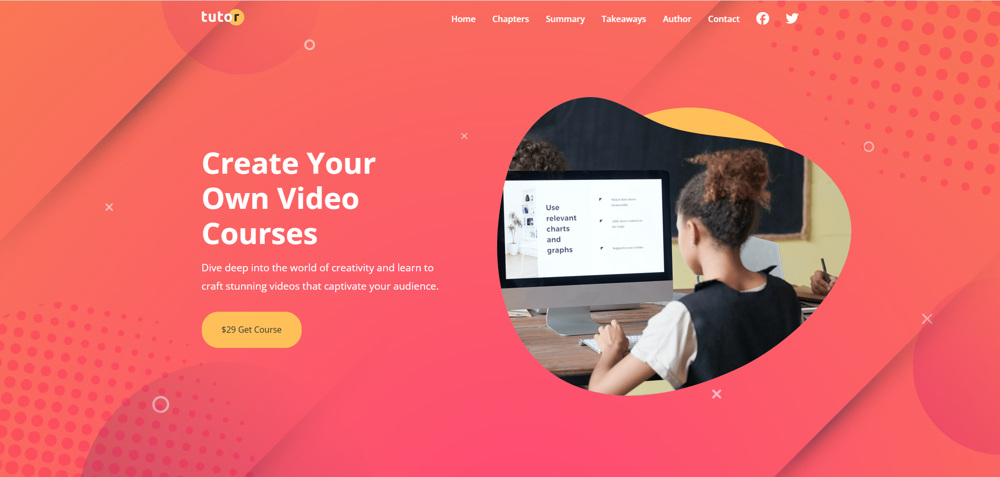 | 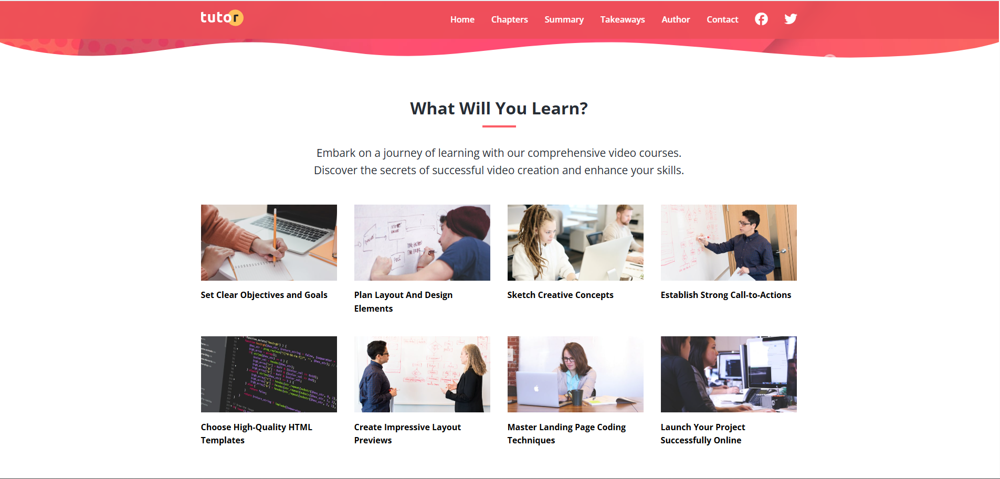 | 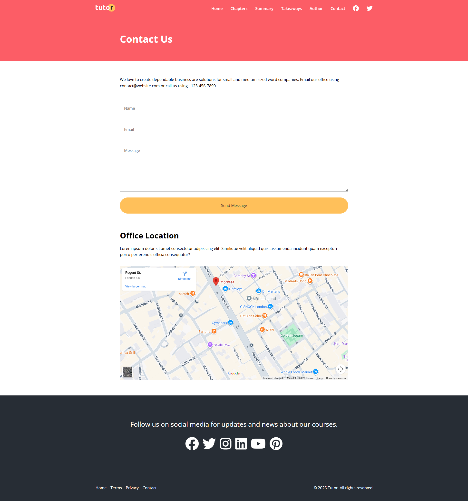 |

###  Course Content Pages

| Chapters | Course Summary | Course Details & Author |
|----------|----------------|-------------------------|
| 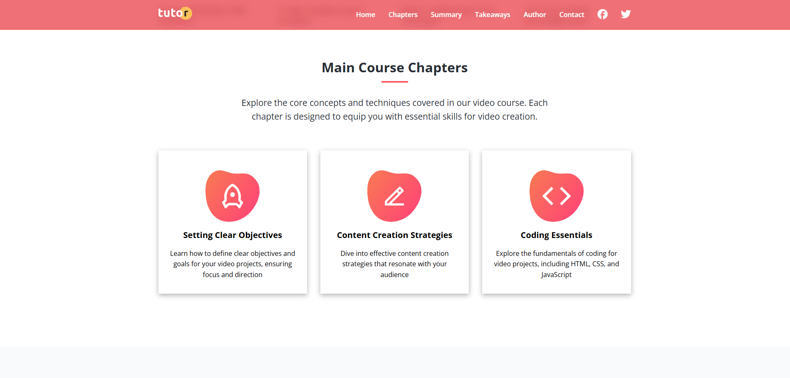 | 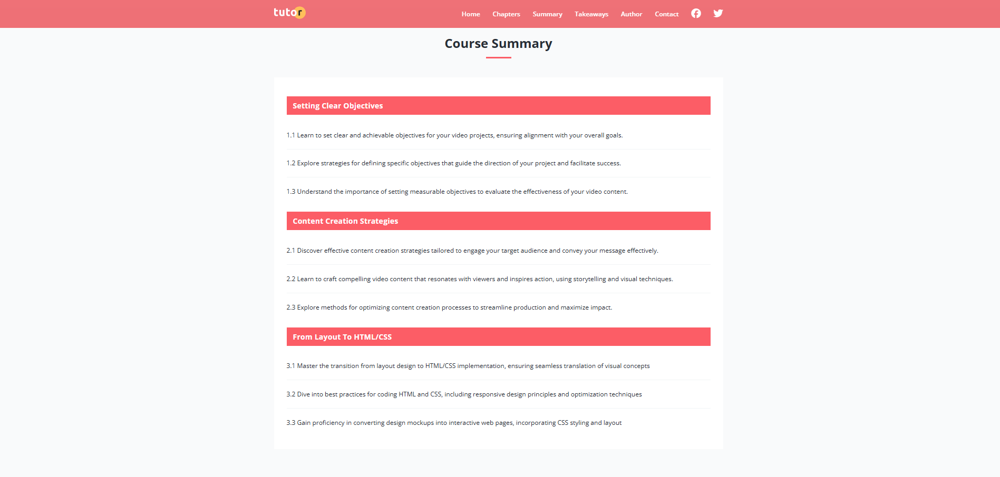 | 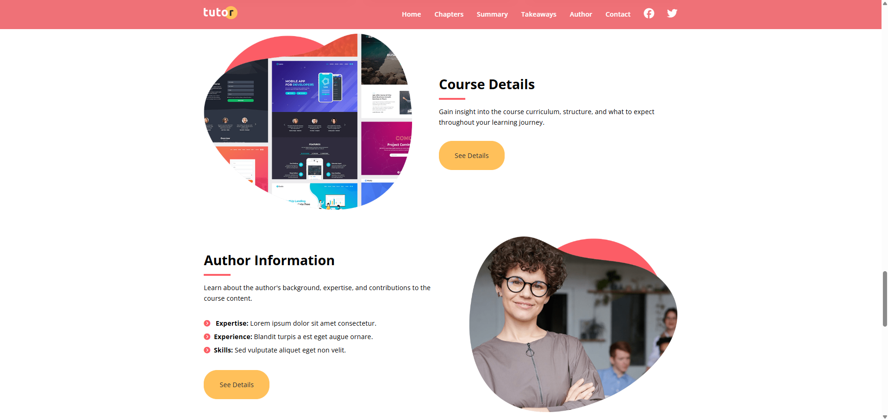 |

###  Learning Highlights

| Takeaways | Stats | Newsletter |
|-----------|-------|------------|
| 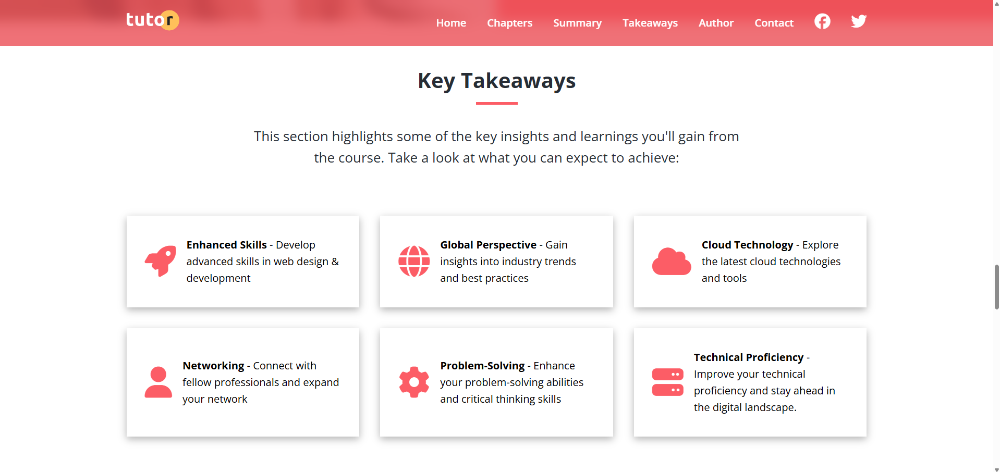 | 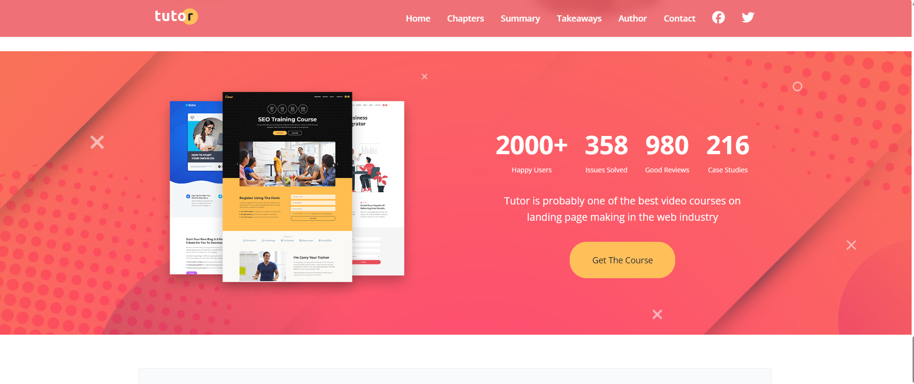 | 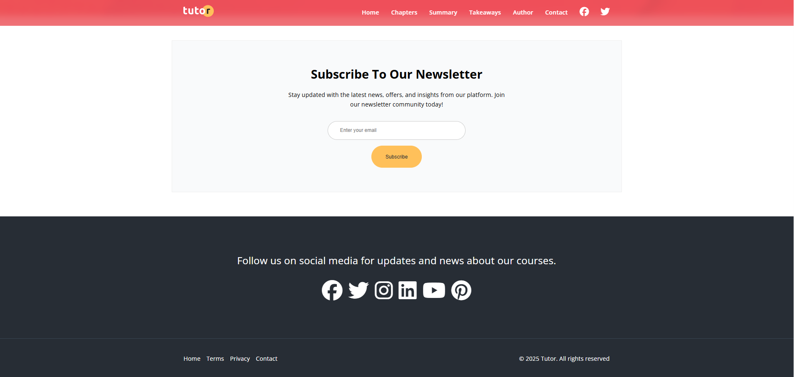 |

## 📚 What I Learned

Through these projects and the course, I improved my skills in:

- Structuring websites with semantic HTML  
- Designing responsive layouts using CSS Flexbox & Grid  
- Implementing modern UI components and forms  
- Applying media queries and responsive units  
- Deploying live projects online

---

⭐ Feel free to explore the projects and share feedback!
